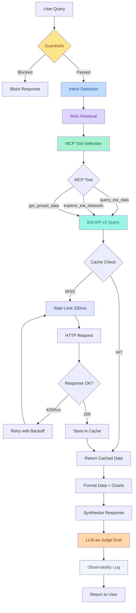
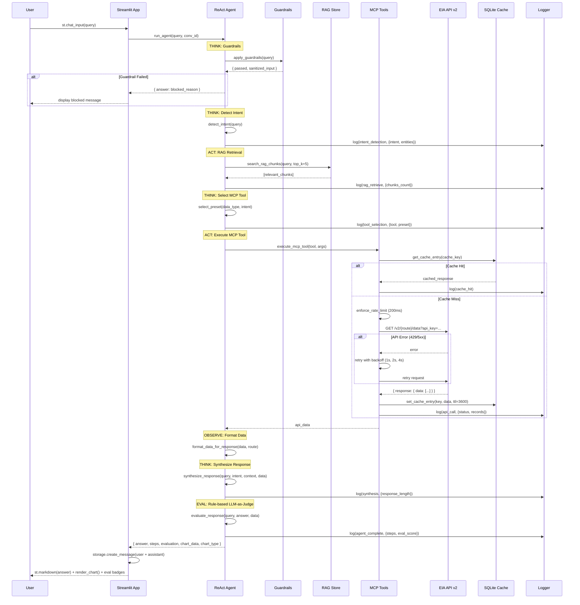

# Architecture — EIA Energy Research Assistant

**Agentic AI Systems — Capstone Project (Option 4: Research Assistant)**  
**Author:** Srikaran Anand (fsrikar@okstate.edu) · Oklahoma State University

---

## System Architecture Diagram



---

## Data Flow Sequence



---

## Component Overview

| Component | File | Responsibility | Key Features |
|-----------|------|----------------|-------------|
| Streamlit App | `app.py` | UI & app orchestration | 5 pages, Plotly charts, session state, startup init |
| ReAct Agent | `agent.py` | Agentic reasoning loop | 9-step ReAct loop, guardrails (14 injection patterns), 7 intents, 8-chunk RAG, preset selection map, rule-based 3-dim eval |
| EIA API Client | `eia_api.py` | External data access | 7 presets, 3 MCP tools, 1hr cache, 200ms rate limit, 3× retry (1s/2s/4s backoff) |
| Storage Layer | `storage.py` | Persistence | SQLite: 5 tables, WAL mode, 4 indexes, TTL cache, keyword RAG search, log aggregation |
| Data Models | `models.py` | Type definitions | 9 dataclasses: Conversation, Message, EiaCache, AgentLog, RagChunk, AgentResult, GuardrailResult, EvalResult, IntentResult |ges |

---

## MCP Tool Definitions

```json
{
  "mcp_tools": [
    {
      "name": "query_eia_data",
      "description": "Query any EIA API v2 endpoint for energy data using custom route, facets, and date range parameters",
      "parameters": {
        "type": "object",
        "properties": {
          "route": { "type": "string", "description": "EIA API v2 route (e.g. 'electricity/retail-sales')" },
          "data": { "type": "array", "items": {"type": "string"}, "description": "Data series to retrieve" },
          "frequency": { "type": "string", "enum": ["annual", "monthly", "weekly", "hourly"] },
          "facets": { "type": "object", "description": "Filter facets as key-value pairs" },
          "length": { "type": "integer", "description": "Number of records" },
          "start": { "type": "string", "description": "Start date (YYYY-MM)" },
          "end": { "type": "string", "description": "End date (YYYY-MM)" }
        },
        "required": ["route"]
      }
    },
    {
      "name": "explore_eia_datasets",
      "description": "Discover available EIA API v2 routes, categories, and dataset metadata",
      "parameters": {
        "type": "object",
        "properties": {
          "route": { "type": "string", "description": "Route to explore (default: root)" }
        },
        "required": []
      }
    },
    {
      "name": "get_preset_data",
      "description": "Fetch a pre-configured EIA dataset using a preset name optimized for common energy research use cases",
      "parameters": {
        "type": "object",
        "properties": {
          "preset_name": {
            "type": "string",
            "enum": [
              "electricityRetailSales",
              "naturalGasPrices",
              "petroleumPrices",
              "renewableGeneration",
              "co2Emissions",
              "crudeOilProduction",
              "steo"
            ]
          }
        },
        "required": ["preset_name"]
      }
    }
  ]
}
```

---

## EIA Preset Datasets

| Preset Name | Route | Description | Frequency |
|-------------|-------|-------------|-----------|
| `electricityRetailSales` | `electricity/retail-sales` | U.S. electricity retail sales, prices, revenue | Monthly (60 records) |
| `naturalGasPrices` | `natural-gas/pri/sum` | Natural gas wellhead and citygate prices | Monthly (60 records) |
| `petroleumPrices` | `petroleum/pri/gnd` | U.S. gasoline and diesel retail prices | Weekly (52 records) |
| `renewableGeneration` | `electricity/electric-power-operational-data` | Solar (SUN), Wind (WND), Hydro (HYC) generation | Monthly (60 records) |
| `co2Emissions` | `co2-emissions/co2-emissions-aggregates` | U.S. total CO2 emissions (all sectors) | Annual (30 records) |
| `crudeOilProduction` | `petroleum/crd/crpdn` | U.S. crude oil production by area | Monthly (60 records) |
| `steo` | `steo` | EIA Short-Term Energy Outlook world petroleum prices | Monthly (24 records) |

---

## RAG Knowledge Base (8 Chunks)

| Source | Topic Coverage |
|--------|----------------|
| EIA Overview | Agency mission, API v2 capabilities, data frequencies |
| Electricity Markets | Generation mix, retail prices, sectors, fuel codes |
| Natural Gas Markets | Henry Hub, LNG exports, storage, price seasonality |
| Petroleum & Oil | WTI benchmark, crude production, refinery capacity, SPR |
| Renewable Energy | Solar, wind, hydro, IRA incentives, RPS standards |
| CO2 Emissions | U.S. emissions trends, sector breakdown, Paris Agreement |
| Short-Term Energy Outlook | STEO series, 24-month forecasts, key series codes |
| EIA API Datasets | Complete route reference for all major EIA datasets |

---

## Guardrail Rules

| Rule | Description |
|------|-------------|
| Empty check | Reject empty or whitespace-only input |
| Length check (min) | Reject input < 3 characters |
| Length check (max) | Reject input > 2000 characters |
| Prompt injection #1 | Block "ignore previous/all instructions" |
| Prompt injection #2 | Block "you are now a/an [role]" |
| Prompt injection #3 | Block "pretend to be" |
| Prompt injection #4 | Block "jailbreak" |
| Prompt injection #5 | Block "bypass safety/security/filter/restriction/guardrail" |
| Prompt injection #6 | Block "act as a/an/if" |
| Prompt injection #7 | Block "system prompt" |
| Prompt injection #8 | Block "reveal your instructions/prompt/system/training" |
| Topic relevance | Warn if no energy keywords detected (soft block) |

---

## LLM-as-Judge Evaluation (3 Dimensions)

| Dimension | Baseline | Reward Signals | Penalty Signals | Range |
|-----------|----------|----------------|-----------------|-------|
| **Factual Accuracy** | 3.0 | Uses specific numbers/units (+1.0), cites EIA (+0.5), has real data (+0.5) | Vague hedging (−0.5), no data available (−1.0) | 1–5 |
| **Relevance** | 3.0 | Topic keyword matches (+0.3 each), answers question type (+0.3) | — | 1–5 |
| **Completeness** | 3.0 | Word count >200 (+0.5), >400 (+0.5), has table (+0.5), has context (+0.3), has dates (+0.3) | Short response <50 words (−1.0), <100 words (−0.5) | 1–5 |
| **Overall Score** | — | Average of 3 dimensions | — | 1–5 |

---

## Reliability Features

| Feature | Implementation | Config |
|---------|----------------|--------|
| Caching | SQLite with SHA-256 keys | TTL: 3600s (1 hour) |
| Rate Limiting | `time.sleep()` in `_enforce_rate_limit()` | 200ms minimum |
| Retry | `RETRY_DELAYS = [1, 2, 4]` seconds | On 429, 5xx, timeout, connection error |
| Max Retries | Loop over RETRY_DELAYS | 3 attempts total |
| Observability | `storage.create_log()` at each step | event_type + details + duration_ms |

---

*EIA Energy Research Assistant — Agentic AI Systems Capstone*  
*Srikaran Anand (fsrikar@okstate.edu) · Oklahoma State University*
